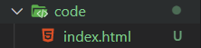
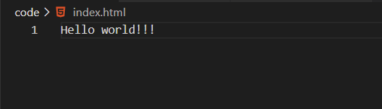
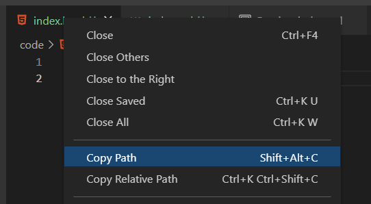
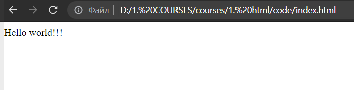
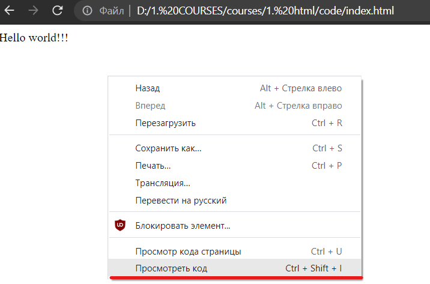
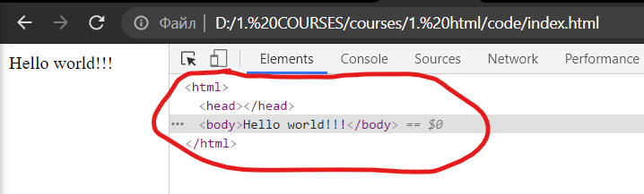
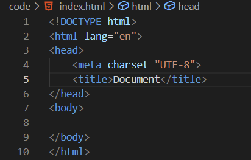
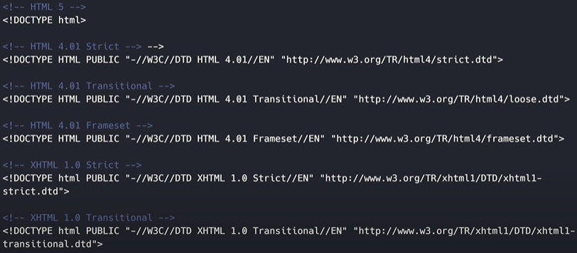
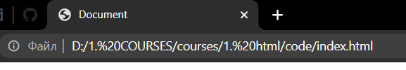

# `Создание документа`

Можно использовать любой текстовый редактор к примеру: Блакнот, WebStorm, Visual Studio Code, Atom, и многие другие.

Лично я использую редактор **Visual Studio Code**.

Шаги по созданию файла для написания кода:
1. Открыть текстовый редактор
2. Создать файл по шаблону `название.html`

Пояснения: 
- `название` - любой произвольный набор букв
- расширение (`.html`) **обязательно**

К примеру у меня в папке *code*, находится файл *index.html*

`index.html` - это корневой файл вашего проекта. Когда вы открываете браузер и вбиваете какой-то url в поиске, браузер грузит первым делом именно этот файл. После происходит загрузка связующих ресурсов, которые определенны в этом файле (index.html).

# `Разметка`

Создав документ мы уже сразу можем писать любую текстовую информацию в него и она отобразится в браузере.

Открываем файл *index.html*, пишем в него произвольный текст.

Нам надо скопировать путь к этому *index.html-файлу*, для того чтобы браузер понимал к какому именно файлу обращаться для его отображения.

Oткрывем браузер, в адресной строке вставляем скопированный путь к файлу. И в конечном итоге мы видим результат.

Но это у нас не валидный *html-документ*. Валидность мы разберем чуть позже.

## `Консоль разработчика`

В браузере откроем консоль разработчика. Сделать можем это разными путями.

**Первый**: с помощью правой кнопкой мыши, и выбираем посмотреть код страницы.

**Второй**: нажать клавишу F12.

И тут у нас появляется консоль разработчика. Откроем вкладку *Elements*.

И мы можем видеть, что наш код, в *index.html* не имеет таких тегов как: *html*, *head*, *body*. Но браузер исправляет валидность документа самостоятельно. Тем самым он понимает наш написанный код.

# `Базовая структура`

## `DOCTYPE`

Базовая разметка у нас есть, давайте разбираться.

На первой строке кода, у нас указывается такой флаг *DOCTYPE*. Он помогает браузеру понимать, какая версия языка используется. В настоящее время последняя версия языка HTML - это HTML5.

История версий HTML:

## `html-тег`

Первый тег - корневой (`html`). Оборачивает весь *html-документ* и внутри которого добавляется все содержание.

    <html lang="en">

Все теги делятся на две категории: **парные** и **одиночные**

*Парные*, которые имеют структуру открывающиеся и закрывающиеся тег `<html></html>`.

*Одинарные* имеет следующую структуру: `<meta />`.

Также теги могут содержать атрибуты - расширяют стандартные возможности тега.

- У каждого тега свой набор атрибутов
- Порядок атрибутов не имеет значения

Так вот первый атрибут, который мы видим это атрибут `lang` у тега *html*.

Если ваш сайт англоязычный, то устанавливается `lang="en"`, если русский то - `lang="ru"`.

Следующий атрибут это у тега *meta*, атрибут `charset` - устанавливает кодировку *html-документа*. У нас в качестве значения атрибута указано `UTF-8` это самый распространный вид кодировки.

Двигаемся дальше.

# `head, body теги`

Любой *html-документ* содержит две важные секции `head` и `body`.

В теге `head` мы указываем информацию об *html-документе*.

Это может быть кодировка

    <meta charset="UTF-8">

Это может быть заголовок

    <title>Document</title>

То есть мы указываем все основные вещи:
1) вспомогательную и описательную информацию документа
2) данные этого тега не отображаются на странице браузера 

В теге `body` мы указываем различную разметку *html-документа*. Именно содержимое этого тега отображается в браузере.